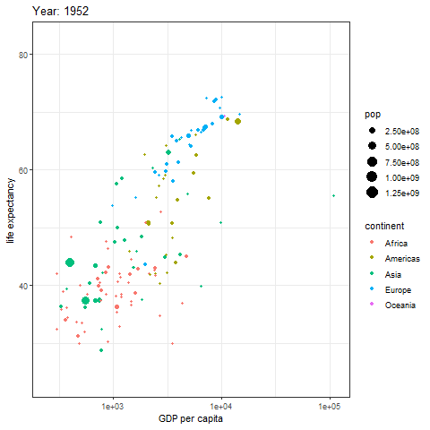
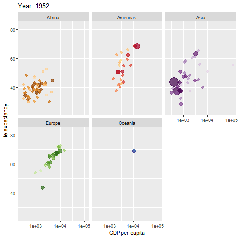
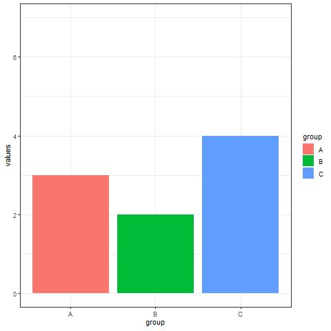
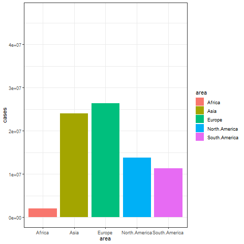
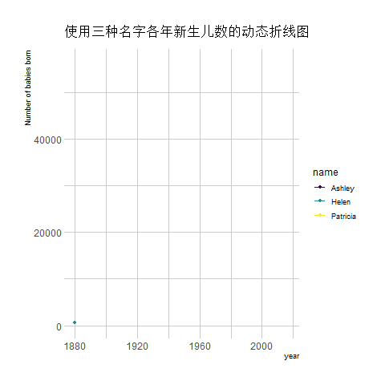
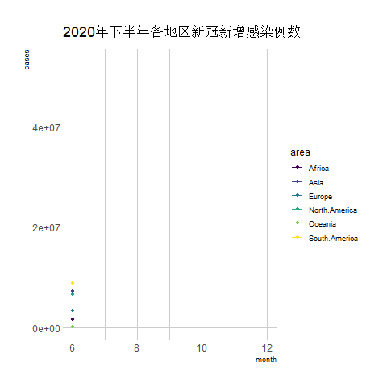
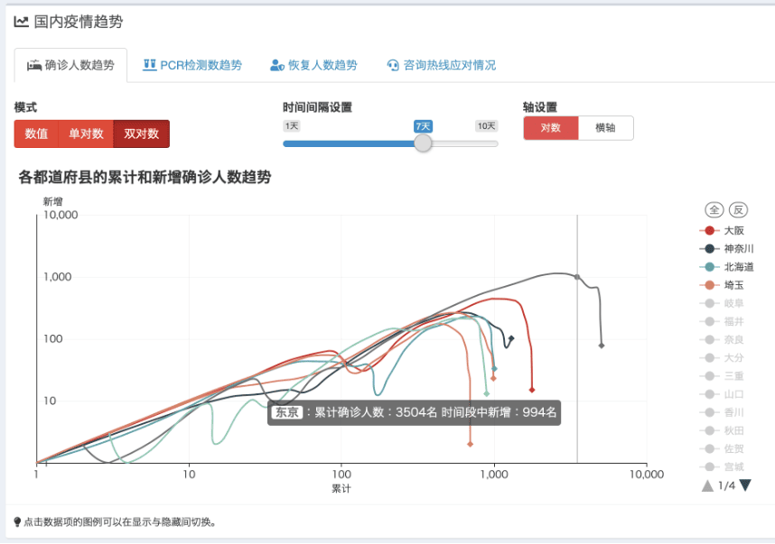
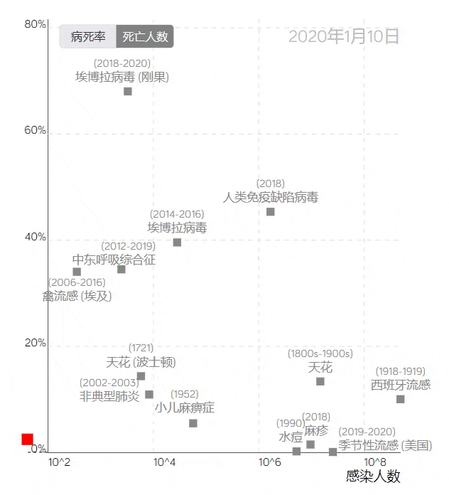

## 环境配置

-   系统要求： 跨平台（Linux/MacOS/Windows）

-   编程语言：R

-   依赖包：`gapminder`; `ggplot2`; `gganimate`; `gifski`; `Cairo`; `babynames`; `hrbrthemes`; `dplyr`; `viridis`; `tidyr`;

```{r packages setup, message=FALSE, warning=FALSE, output=FALSE}
# 安装包
if (!requireNamespace("gapminder", quietly = TRUE)) {
  install.packages("gapminder")
}
if (!requireNamespace("ggplot2", quietly = TRUE)) {
  install.packages("ggplot2")
}
if (!requireNamespace("gganimate", quietly = TRUE)) {
  install.packages("gganimate")
}
if (!requireNamespace("gifski", quietly = TRUE)) {
  install.packages("gifski")
}
if (!requireNamespace("Cairo", quietly = TRUE)) {
  install.packages("Cairo")
}
if (!requireNamespace("babynames", quietly = TRUE)) {
  install.packages("babynames")
}
if (!requireNamespace("hrbrthemes", quietly = TRUE)) {
  install.packages("hrbrthemes")
}
if (!requireNamespace("dplyr", quietly = TRUE)) {
  install.packages("dplyr")
}
if (!requireNamespace("viridis", quietly = TRUE)) {
  install.packages("viridis")
}
if (!requireNamespace("tidyr", quietly = TRUE)) {
  install.packages("tidyr")
}

# 加载包
library(gapminder)
library(ggplot2)
library(gganimate)
library(gifski)
library(Cairo)
library(babynames)
library(hrbrthemes)
library(dplyr)
library(viridis)
library(tidyr)
```

```{r}
sessioninfo::session_info("attached")
```

## 数据准备

主要利用R自带数据集和新冠感染数据进行绘图

```{r load data}
#| message: false

# data_gapminder
data_gapminder <- gapminder

# data_babynames
data_babynames <- babynames

# data_covi19
data_covi19 <- readr::read_csv("https://bizard-1301043367.cos.ap-guangzhou.myqcloud.com/data_covi19.csv")
data_covi19$date <- c(6:12)
data_covi19 <- gather(data_covi19, key = "area", value = "cases", 2:7)

# data_covi19_bar
data_covi19_bar_10 <- filter(data_covi19, date == 10)
data_covi19_bar_10$frame <- rep("a",6)

data_covi19_bar_12 <- filter(data_covi19, date == 12)
data_covi19_bar_12$frame <- rep("b",6)

data_covi19_bar <- rbind(data_covi19_bar_10,data_covi19_bar_12)
```

## 可视化

### 1. 散点气泡动画图

#### 1.1 以`gapminder`数据集为例

```{r}
#| label: fig1PointAnimation
#| fig-cap: "散点气泡动画图"
#| out.width: "95%"
#| warning: false
#| eval: false

#散点气泡动画图----
p <- ggplot(data_gapminder, aes(gdpPercap, lifeExp, size = pop, color = continent)) +
  geom_point() +
  scale_x_log10() +
  theme_bw() +
  #绘制动画
  labs(title = 'Year: {frame_time}', x = 'GDP per capita', y = 'life expectancy') +
  transition_time(year) +
  ease_aes('linear')

animate(p, renderer = gifski_renderer())
```

::: {#fig-PointAnimation}
{fig-alt="PointAnimation" fig-align="center" width="95%"}

散点气泡动画图
:::

上图为随着时间变化各地区首都寿命与GDP的散点动画图，其中散点大小表示人口，颜色表示地区。

#### 1.2 分组散点气泡动画图

除了将分组展示在一张图上，还可以分开绘制

```{r}
#| label: fig2GroupPointAnimation
#| fig-cap: "分组散点气泡动画图"
#| out.width: "95%"
#| warning: false
#| eval: false

# 分组散点气泡图
p <- ggplot(data_gapminder, aes(gdpPercap, lifeExp, size = pop, colour = country)) +
  geom_point(alpha = 0.7, show.legend = FALSE) +
  scale_colour_manual(values = country_colors) +
  scale_size(range = c(2, 12)) +
  scale_x_log10() +
  facet_wrap(~continent) +  #按地区填色分组
  # 绘制动画图
  labs(title = 'Year: {frame_time}', x = 'GDP per capita', y = 'life expectancy') +
  transition_time(year) +
  ease_aes('linear')

animate(p, renderer = gifski_renderer())
```

::: {#fig-GroupPointAnimation}
{fig-alt="GroupPointAnimation" fig-align="center" width="95%"}

分组散点气泡动画图
:::

上图将不同地区分开绘制。

### 2. 区间过渡条形图

区间过渡条形图可以在两组数据间实现过渡动画。

```{r}
#| label: fig3frame
#| fig-cap: "区间过渡条形图"
#| out.width: "95%"
#| warning: false
#| eval: false

# 区间过渡条形图----
a <- data.frame(group=c("A","B","C"), values=c(3,2,4), frame=rep('a',3))
b <- data.frame(group=c("A","B","C"), values=c(5,3,7), frame=rep('b',3))
data <- rbind(a,b)  


# 区间过渡动画
p <- ggplot(data, aes(x=group, y=values, fill=group)) + 
  geom_bar(stat='identity') +
  theme_bw() +
# 绘制动画
  transition_states(
    frame,  #frame作为区间依据
    transition_length = 2,
    state_length = 1
  ) +
  ease_aes('sine-in-out')

animate(p, renderer = gifski_renderer())
```

::: {#fig-frame}
{fig-alt="frame" fig-align="center" width="95%"}

区间过渡条形图
:::

实现两组数据的过渡动画。

以新冠感染数据为例

```{r}
#| label: fig4covi19
#| fig-cap: "以新冠感染数据为例"
#| out.width: "95%"
#| warning: false
#| eval: false

#以新冠数据为例
##筛选数据
data_covi19_bar <- subset(data_covi19_bar, cases > 50000)

p <- ggplot(data_covi19_bar, aes(x=area, y=cases, fill=area)) + 
  geom_bar(stat='identity') +
  theme_bw() +
# 绘制动画
  transition_states(
    frame,
    transition_length = 2,
    state_length = 1
  ) +
  ease_aes('sine-in-out')

animate(p, renderer = gifski_renderer())
```

::: {#fig-covi19}
{fig-alt="covi19" fig-align="center" width="95%"}

以新冠感染数据为例
:::

上图展示了2020年10月与12月各地区新增感染人数的过渡动画图。

### 3. 动态折线图

**以`babynames`数据集为例**

```{r}
#| label: fig5babynames
#| fig-cap: "动态折线图"
#| out.width: "95%"
#| warning: false
#| eval: false

#动态折线图----
don <- data_babynames %>% 
  filter(name %in% c("Ashley", "Patricia", "Helen")) %>%
  filter(sex=="F")


#绘图
don %>%
  ggplot( aes(x=year, y=n, group=name, color=name)) +
  geom_line() +
  geom_point() +
  scale_color_viridis(discrete = TRUE) +
  ggtitle("使用三种名字各年新生儿数的动态折线图") +
  theme_ipsum() +
  ylab("Number of babies born") +
  transition_reveal(year) #以时间作为动画依据
```

::: {#fig-babynames}
{fig-alt="babynames" fig-align="center" width="95%"}

动态折线图
:::

上图展示了各年使用以上三种名字的新生儿的数量变化动画图。

**以新冠感染数据为例**

```{r}
#| label: fig6covi19
#| fig-cap: "以新冠感染数据为例"
#| out.width: "95%"
#| warning: false
#| eval: false

##新冠数据为例
data_covi19 %>%
  ggplot( aes(x=date, y=cases, group=area, color=area)) +
  geom_line() +
  geom_point() +
  scale_color_viridis(discrete = TRUE) +
  ggtitle("2020年下半年各地区新冠新增感染例数") +
  theme_ipsum() +
  ylab("cases") +
  xlab("month") +
  transition_reveal(date) #以时间作为动画依据
```

::: {#fig-2covi19}
{fig-alt="2covi19" fig-align="center" width="95%"}

以新冠感染数据为例
:::

上图为2020年下半年各地区新冠新增感染例数的折线动画图，横坐标表示月份。

## 应用场景

动画图可应用于各种shiny网页，实现数据的动态更新与实况展示。

::: {#fig-AnimationApplications}
{fig-alt="AnimationApp1" fig-align="center" width="60%"}

动画图应用场景
:::

上图为疫情期间实时展现日本疫情动态的shiny网页工具GitHub - swsoyee/2019-ncov-japan: 🦠 Interactive dashboard for real-time recording of COVID-19 outbreak in Japan

::: {#fig-AnimationApplications}
{fig-alt="AnimationApp2" fig-align="center" width="60%"}

动画图应用场景
:::

北京大学可视化与可视分析实验室研发的疫情轨迹图。

上图的疫情轨迹线从病死率和感染人数两个维度出发，以红色方块代表新冠肺炎，将其置于其他传染病的数据中间，为疫情发展给出一个直观的侧写，明确地反映新冠肺炎和其他大规模的流行病之间的差异。

## 参考文献

\[1\] Bryan J (2023). gapminder: Data from Gapminder. R package version 1.0.0, https://CRAN.R-project.org/package=gapminder.

\[2\] Bryan J (2023). gapminder: Data from Gapminder. R package version 1.0.0, https://CRAN.R-project.org/package=gapminder.

\[3\] H. Wickham. ggplot2: Elegant Graphics for Data Analysis. Springer-Verlag New York, 2016. Pedersen T, Robinson D (2024). gganimate: A Grammar of Animated Graphics. R package version 1.0.9, https://CRAN.R-project.org/package=gganimate.

\[4\] Ooms J, Kornel Lesiński, Authors of the dependency Rust crates (2024). gifski: Highest Quality GIF Encoder. R package version 1.32.0-1, https://CRAN.R-project.org/package=gifski.

\[5\] Urbanek S, Horner J (2023). Cairo: R Graphics Device using Cairo Graphics Library for Creating High-Quality Bitmap (PNG, JPEG, TIFF), Vector (PDF, SVG, PostScript) and Display (X11 and Win32) Output. R package version 1.6-2, https://CRAN.R-project.org/package=Cairo.

\[6\] Wickham H (2021). babynames: US Baby Names 1880-2017. R package version 1.0.1, https://CRAN.R-project.org/package=babynames.

\[7\] Rudis B (2024). hrbrthemes: Additional Themes, Theme Components and Utilities for 'ggplot2'. R package version 0.8.7, https://CRAN.R-project.org/package=hrbrthemes.

\[8\] Wickham H, François R, Henry L, Müller K, Vaughan D (2023). dplyr: A Grammar of Data Manipulation. R package version 1.1.4, https://CRAN.R-project.org/package=dplyr.

\[9\] Simon Garnier, Noam Ross, Robert Rudis, Antônio P. Camargo, Marco Sciaini, and Cédric Scherer (2024). viridis(Lite) - Colorblind-Friendly Color Maps for R. viridis package version 0.6.5. Wickham H, Vaughan D, Girlich M (2024). tidyr: Tidy Messy Data. R package version 1.3.1, https://CRAN.R-project.org/package=tidyr.

