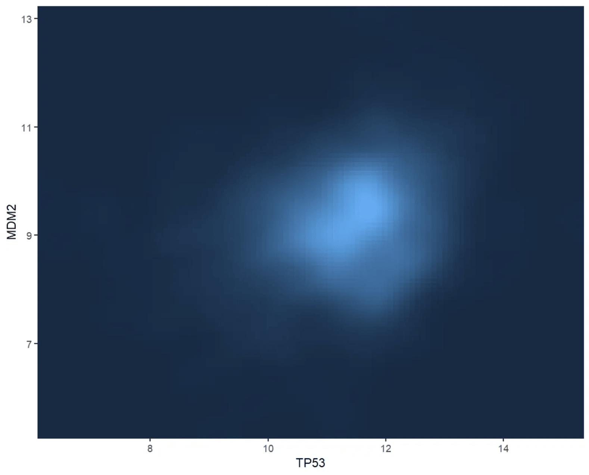
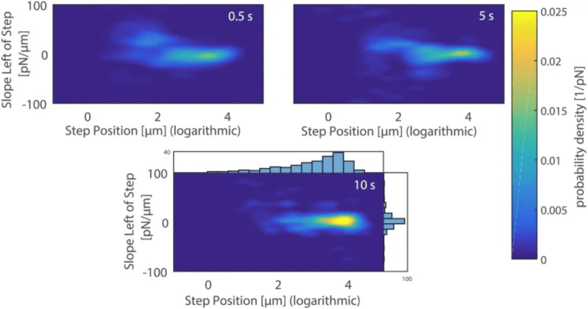
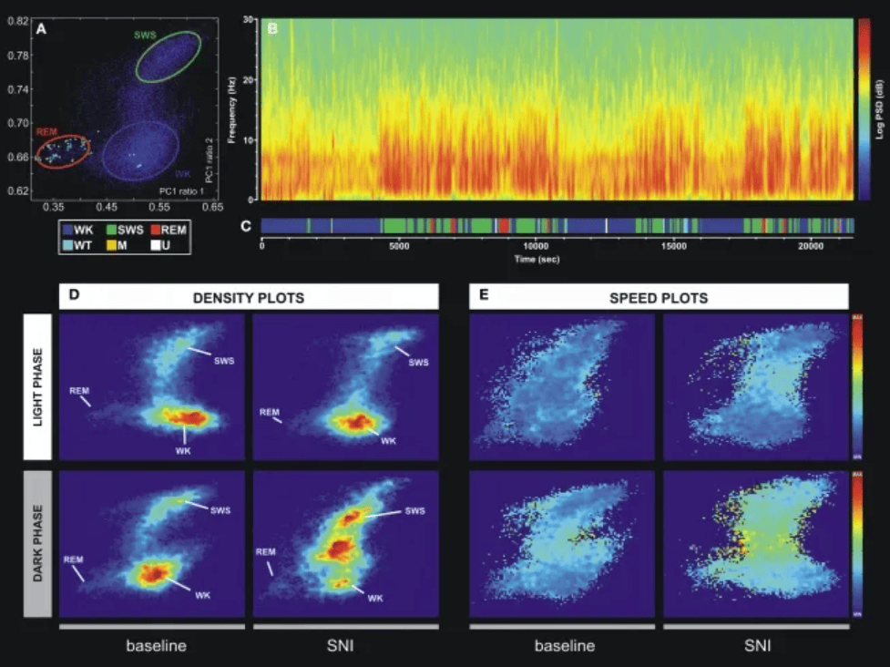
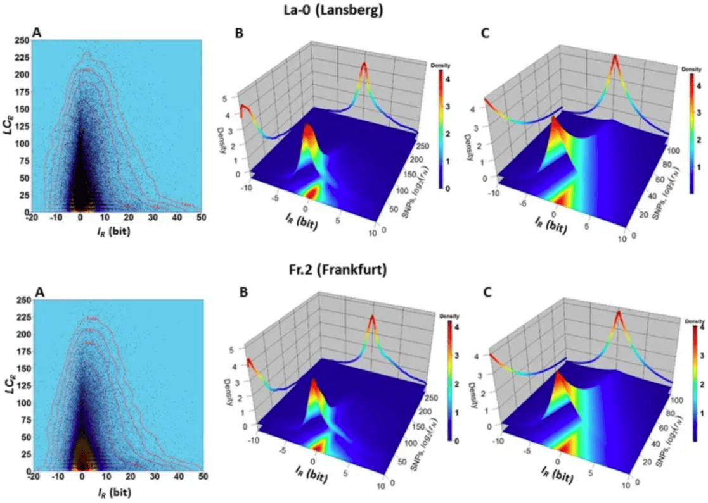

二维密度图可以表示两个数值变量组合的分布，通过颜色渐变（或等高线高低）表示区域内观测值的数量。既可以识别数据集中趋势，也可以分析两个变量之间是否存在某种关系等。散点图在展示大型数据集时可能变得难以解读，因为点会重叠，无法单独区分，此时可以使用二维密度图。

## 示例

{fig-alt="Density2D DEMO" fig-align="center" width="60%"}

此图展示了TP53和MDM2基因表达值之间的二维核密度分布。通过栅格图的填充颜色，可以直观地看到在不同TP53和MDM2值组合下，样本的密度（即样本数量）。颜色越深表示该区域的样本密度越低，而颜色较浅表示样本密度较高。这种可视化有助于识别基因表达的模式和潜在的相关性。

## 环境配置

-   系统要求： 跨平台（Linux/MacOS/Windows）

-   编程语言：R

-   依赖包：`ggplot2`, `RColorBrewer`, `hexbin`, `MASS`, `plotly`, `mvtnorm`, `patchwork`

```{r packages setup, message=FALSE, warning=FALSE, output=FALSE}
# 安装包
if (!requireNamespace("ggplot2", quietly = TRUE)) {
  install.packages("ggplot2")
}
if (!requireNamespace("RColorBrewer", quietly = TRUE)) {
  install.packages("RColorBrewer")
}
if (!requireNamespace("hexbin", quietly = TRUE)) {
  install.packages("hexbin")
}
if (!requireNamespace("MASS", quietly = TRUE)) {
  install.packages("MASS")
}
if (!requireNamespace("plotly", quietly = TRUE)) {
  install.packages("plotly")
}
if (!requireNamespace("mvtnorm", quietly = TRUE)) {
  install.packages("mvtnorm")
}
if (!requireNamespace("patchwork", quietly = TRUE)) {
  install.packages("patchwork")
}

# 加载包
library(ggplot2)
library(RColorBrewer)
library(hexbin)
library(MASS)
library(plotly)
library(mvtnorm)
library(patchwork)
```

```{r}
sessioninfo::session_info("attached")
```

## 数据准备

使用 R 内置数据集 `mtcars`和 [CSC Xena DATASETS](https://xenabrowser.net/datapages/?hub=https://gdcv18.xenahubs.net:443) 的 `TCGA-BRCA.star_counts.tsv` 数据集。

```{r load data}
#| message: false

# mtcars
data_mtcars <- mtcars[, c("mpg", "hp")]

# TCGA-BRCA.star_counts
tcga_raw <- readr::read_tsv("https://bizard-1301043367.cos.ap-guangzhou.myqcloud.com/TCGA-BRCA.star_counts.tsv")

tcga_tp53_mdm2 <- tcga_raw[tcga_raw$Ensembl_ID %in% c("ENSG00000141510.18", "ENSG00000131747.15"), ]
TP53_values <- tcga_tp53_mdm2[1, -1]
MDM2_values <- tcga_tp53_mdm2[2, -1]

data_tcga <- data.frame(TP53 = as.numeric(TP53_values),
                        MDM2 = as.numeric(MDM2_values))
```


## 可视化

### 1. 二维直方图

二维直方图用于分析两个变量之间的关系，绘图区域被划分为多个方块。使用`geom_bin_2d()`绘制二维直方图。此函数提供了`bins`参数来控制要显示的箱数。`bins`决定每一个箱体包含数据的多少，改变`bins`会对图形造成很大的影响，也会影响到想要表达的信息。

```{r}
#| label: fig-BasicPlot
#| fig-cap: "二维直方图"
#| out.width: "95%"
#| warning: false

# 二维直方图
p <- ggplot(data_tcga, aes(x = TP53, y = MDM2)) +
  geom_bin2d() +
  labs(fill = "Gene_expression\n(STAR_counts)") + 
  theme_bw()

p
```

此图为TP53和MDM2基因表达的二维直方图，通过颜色深浅表示每个区域的数据点数量，能够清晰地显示数据分布和密度。颜色越深表示该区域的样本密度越低，而颜色较浅表示样本密度较高。

```{r}
#| label: fig-ChangeColor
#| fig-cap: "改变颜色"
#| out.width: "95%"
#| warning: false
#| fig-width: 12
#| fig-height: 5

# 修改bins + 调色板
p1 <- 
  ggplot(data_tcga, aes(x = TP53, y = MDM2)) +
  geom_bin2d(bins = 40) +
  scale_fill_continuous(type = "viridis") +
  labs(fill = "Gene_expression\n(STAR_counts)") + 
  theme_bw()

# 去除网格线 + 自定义颜色
p2 <- 
  ggplot(data_tcga, aes(x = TP53, y = MDM2)) +
  geom_bin2d(bins = 40) +
  scale_fill_gradient(low = "blue", high = "red") + 
  labs(fill = "Gene_expression\n(STAR_counts)") + 
  theme_bw() +
  theme(panel.grid.major = element_blank(), 
        panel.grid.minor = element_blank())
p1+p2
```

此图为TP53和MDM2基因表达的二维直方图，修改了bins参数和颜色使得图形更加美观，更能传递有效信息。左图随着数据增大从紫色渐变为黄色，右图由蓝色渐变为红色。

### 2. 交互二维直方图

使用`mvtnorm`包和`plotly`包绘制可交互二维直方图。

```{r}
#| label: fig-Interaction
#| fig-cap: "交互"
#| out.width: "95%"
#| warning: false

fig <- plot_ly(data_tcga, x = ~TP53, y = ~MDM2)
fig2 <- subplot(
  fig %>% add_histogram2d()
)

fig2
```

此图为 TP53 和 MDM2 的二维直方图，随着数据增大格子从紫色渐变为黄色。交互式图形允许用户悬停在不同区域以查看具体的密度值和数量，方便获取更详细的信息。

使用 R 自带的数据集 `mtcars`。

```{r}
#| label: fig-Usemtcars
#| fig-cap: "使用 R 自带的数据集 `mtcars`"
#| out.width: "95%"
#| warning: false

# 改变bins + 调色板
fig <- plot_ly(data_mtcars, x = ~mpg, y = ~hp)
fig2 <- fig %>% add_histogram2d(colorscale = "Blues", nbinsx = 5, nbinsy = 6)

fig2
```

此图使用 mtcars 数据集的 mpg（每加仑英里数）和 hp（马力）来绘制二维直方图，随着数据增大蓝色逐渐变浅。交互式图形允许用户悬停在不同区域以查看具体的密度值和数量，方便获取更详细的信息。

### 3. 六边形箱图

六边形箱图是一种可视化二维数据分布的图表类型。它将数据按照坐标轴划分为多个小六边形区域，并根据每个区域内数据点的数量进行不同的着色，以展示数据分布情况。使用`geom_hex()`函数绘制六边形箱图。

```{r}
#| label: fig-geom_hex
#| fig-cap: "六边形箱图"
#| out.width: "95%"
#| warning: false

# 六边形箱图
p <- 
  ggplot(data_tcga, aes(x = TP53, y = MDM2)) +
  geom_hex() +
  labs(fill = "Gene_expression\n(STAR_counts)") + 
  theme_bw()
p
```

此六边形图展示了TP53和MDM2基因表达的关系。颜色越深表示该区域的样本密度越低，而颜色较浅表示样本密度较高。

```{r}
#| label: fig-binsColor
#| fig-cap: "修改bins和调色板"
#| out.width: "95%"
#| warning: false

# 修改bins + 调色板
p <- 
  ggplot(data_tcga, aes(x = TP53, y = MDM2)) +
  geom_hex(bins = 40) +
  scale_fill_continuous(type = "viridis") +
  labs(fill = "Gene_expression\n(STAR_counts)") + 
  theme_bw()
p
```

此六边形图展示了TP53和MDM2基因表达的关系，修改了bins参数和颜色使得图形更加美观，更能传递有效信息。

使用`hexbin`包绘制六边形箱图。

```{r}
#| label: fig-hexbin
#| fig-cap: "使用`hexbin`包绘制六边形箱图"
#| out.width: "95%"
#| warning: false

# 使用`hexbin`包绘制六边形箱图
bin <- hexbin(TP53_values, MDM2_values, xbins=40)
my_colors = colorRampPalette(rev(brewer.pal(11,'Spectral')))
par(mar = c(0, 0, 0, 10), pty = "s")
plot(bin, main="" , colramp = my_colors , legend = FALSE)
```

此六边形图使用`hexbin`包，展示了TP53和MDM2基因表达的关系。使用调色板给不同数值区间赋予不同的颜色，使图形更加美观。

### 4. 二维密度图

二维密度图是一种用于可视化两个变量之间的分布和关系的图表类型。它通过在二维平面上绘制密度等高线或填充颜色来表示数据点的分布情况。使用`geom_density_2d`或`stat_density_2d`绘制二维密度图。

```{r}
#| label: fig-2Ddensity
#| fig-cap: "二维密度图"
#| out.width: "95%"
#| warning: false
#| fig-width: 18
#| fig-height: 5

# 仅显示轮廓
p1 <- 
  ggplot(data_tcga, aes(x = TP53, y = MDM2)) +
  geom_density_2d()

# 仅显示区域颜色
p2 <- 
  ggplot(data_tcga, aes(x = TP53, y = MDM2)) +
  stat_density_2d(aes(fill = ..level..), geom = "polygon")

# 轮廓＋区域颜色
p3 <- 
  ggplot(data_tcga, aes(x = TP53, y = MDM2)) +
  stat_density_2d(aes(fill = ..level..), geom = "polygon", colour="white")

p1+p2+p3
```

此对比图提供了对TP53和MDM2基因表达值的多种多层次理解，便于快速识别数据的模式和趋势。二维等密度线可以帮助识别不同密度区域。通过颜色深浅表示基因的表达量，颜色越浅表示密度越高，从而直观展示数据的分布情况。

```{r}
#| label: fig-2DKernelDensity
#| fig-cap: "二维核密度图"
#| out.width: "95%"
#| warning: false

# 栅格图
p <- 
  ggplot(data_tcga, aes(x = TP53, y = MDM2)) +
  stat_density_2d(aes(fill = ..density..), geom = "raster", contour = FALSE) +
  scale_x_continuous(expand = c(0, 0)) +
  scale_y_continuous(expand = c(0, 0)) +
  theme(legend.position='none')
p
```

此图展示了TP53和MDM2基因表达值之间的二维核密度分布，通过颜色深浅表示基因的表达量，颜色越浅表示密度越高。

### 5. 自定义调色板

二维直方图、六边形箱图和二维密度图都可以自定义图表的颜色。可以使用`scale_fill_distiller()`函数定义颜色。

```{r}
#| label: fig-ColorPlatte
#| fig-cap: "自定义调色板"
#| out.width: "95%"
#| warning: false
#| fig-width: 15
#| fig-height: 5

# 自定义调色板
p1 <- 
  ggplot(data_tcga, aes(x = TP53, y = MDM2)) +
  stat_density_2d(aes(fill = ..density..), geom = "raster", contour = FALSE) +
  scale_fill_distiller(palette=4, direction=-1) +
  scale_x_continuous(expand = c(0, 0)) +
  scale_y_continuous(expand = c(0, 0)) +
  theme(legend.position='none')

p2 <- 
  ggplot(data_tcga, aes(x = TP53, y = MDM2)) +
  stat_density_2d(aes(fill = ..density..), geom = "raster", contour = FALSE) +
  scale_fill_distiller(palette=4, direction=1) + #更改调色板的方向从第一个到最后一个
  scale_x_continuous(expand = c(0, 0)) +
  scale_y_continuous(expand = c(0, 0)) +
  theme(legend.position='none')

# 通过调色板名字使用调色板
p3 <- 
  ggplot(data_tcga, aes(x = TP53, y = MDM2)) +
  stat_density_2d(aes(fill = ..density..), geom = "raster", contour = FALSE) +
  scale_fill_distiller(palette= "Spectral", direction=1) +
  scale_x_continuous(expand = c(0, 0)) +
  scale_y_continuous(expand = c(0, 0)) +
  theme(legend.position='none')

p1+p2+p3
```

此图对比了不同调色板设置下的TP53和MDM2基因表达的二维密度分布，通过不同调色板的比较，可以观察到密度图在可视化表达上的差异，帮助选择更适合展示数据特征的颜色方案。

### 6. 三维密度图

可以将散点图数据变换成网格，计算网格每个位置上的数据点数量，然后不用渐变颜色来表示这个数量，而是用第三个维度来表示某些区域的密度更高。

```{r}
#| label: fig-3Ddensity
#| fig-cap: "三维密度图"
#| out.width: "95%"
#| warning: false

# 计算 KDE
kd <- with(data_tcga, MASS::kde2d(TP53, MDM2, n = 50))

plot_ly(x = kd$x, y = kd$y, z = kd$z) %>%
  add_surface() %>%
  layout(scene = list(xaxis = list(title = "TP53"),
                      yaxis = list(title = "MDM2"),
                      zaxis = list(title = "Density")))
```

此图展示了TP53和MDM2基因表达的三维核密度图（KDE），使用plotly包可以实现交互操作，用户可以旋转和缩放图形，深入分析数据，更全面地理解复杂数据集中的变量关系。颜色和高度同时表示数据的大小。

## 应用场景

::: {#fig-Density2DApplications}
{fig-alt="Density2DApp1" fig-align="center" width="60%"}

二维密度图应用
:::

在 0.5 秒（左上）、5 秒（右上）和 10 秒（下）接触时间后打破甘露糖涂层的 AFM 悬臂和 A. castellanii 细胞之间的接触时，斜率与最后一次破裂事件位置的二维密度图。 \[1\]

::: {#fig-Density2DApplications}
{fig-alt="Density2DApp2" fig-align="center" width="60%"}

二维密度图应用
:::

根据 LFP 信号的主成分分析对振荡模式进行统计分类的技术示例。(A) 二维大脑状态图。三个主要簇分别对应于清醒状态 (WK)、慢波睡眠 (SWS) 和快速眼动 (REM) 状态。(B) SI LFP 通道的功率谱图显示了大脑状态事件转换过程中信号功率振荡的不同模式。(C) 从图 A 中所示的二维状态获得的大脑状态睡眠图。编码了六种不同的大脑状态：WK、SWS、REM、胡须抽搐 (WT)、M（未定义运动）和 U（过渡状态）。(D) 从散点图 [例如 (A)] 计算出的密度图，显示了保守的簇拓扑和各种大脑状态的相对丰度。比例从深蓝色（低密度）到红色（高密度）。 (E) 速度图表示二维 StateMap 中自发轨迹的平均值。在三个主要簇（WK、SWS 和 REM）中可以观察到平稳性（低速），而在从一个簇到另一个簇的转换过程中达到最大速度。SNI 损伤后，WK 和 SWS 状态发作之间的速度增加，这也表明神经性疼痛期间 WK/SWS 转换增加。 \[2\]


::: {#fig-Density2DApplications}
{fig-alt="Density2DApp3" fig-align="center" width="60%"}

二维密度图应用
:::

生态型 La-0 和 Fr.2 中变量 𝐼𝑅 和 𝐿⁢𝐶𝑅 之间的依赖关系。 (A) 𝐼𝑅 与 𝐿⁢𝐶𝑅 的二维核密度图表明，大多数 𝐿⁢𝐶𝑅 值位于垂直线 𝐼𝑅=0 周围的窄带中。 (B) 3D 核密度图表明，例如，以高联合概率𝑃(−1≤𝐼𝑅≤1,0≤𝐿⁢𝐶𝑅≤25)（由区间 −2≤𝐼𝑅≤2 和 0≤𝐿⁢𝐶𝑅≤25 形成的方底棱柱的体积，并被覆盖红色到黄色区域的表面截断）观察到值为 −2≤𝐼𝑅≤2 和 0≤𝐿⁢𝐶𝑅≤25 的基因组区域 R。对于这些区域，观察到 SNP 的概率很低（根据方程 (4) 和 (5)，并且支持区域方程 (3) 中 SNP 的归一化计数值很低。在另一个示例中，以低联合概率𝑃(−1≤𝐼𝑅≤1,150≤𝐿⁢𝐶𝑅≤200)（对应于在区间 −1≤𝐼𝑅≤1 和 150≤𝐿⁢𝐶𝑅≤200 内被方底表面截断的棱柱体积），观察到值为 −1≤𝐼𝑅≤1 和 150≤𝐿⁢𝐶𝑅≤200 的基因组区域 R；（C） Farlie–Gumbel–Morgenstern copula 是根据 𝐿⁢𝐶𝑅（Weibull PDF）和 𝐼𝑅（Skew–Laplace PDF）估计的边际分布的非线性拟合构建的。Farlie–Gumbel–Morgenstern copula 分布表明变量 𝐼𝑅 和 𝐿⁢𝐶𝑅 之间存在结构依赖性，该分布以可接受的方式描述了图 B 中显示的经验行为。 \[3\]

## 参考文献

\[1\] Cardoso-Cruz H, Sameshima K, Lima D, Galhardo V. Dynamics of Circadian Thalamocortical Flow of Information during a Peripheral Neuropathic Pain Condition. Front Integr Neurosci. 2011 Aug 23;5:43. doi: 10.3389/fnint.2011.00043. PMID: 22007162; PMCID: PMC3188809.

\[2\] Rey SA, Smith CA, Fowler MW, Crawford F, Burden JJ, Staras K. Ultrastructural and functional fate of recycled vesicles in hippocampal synapses. Nat Commun. 2015 Aug 21;6:8043. doi: 10.1038/ncomms9043. PMID: 26292808; PMCID: PMC4560786.

\[3\] Sanchez R, Mackenzie SA. Genome-Wide Discriminatory Information Patterns of Cytosine DNA Methylation. Int J Mol Sci. 2016 Jun 17;17(6):938. doi: 10.3390/ijms17060938. PMID: 27322251; PMCID: PMC4926471.

\[4\] Rudis, B. (2020). hrbrthemes: Additional Themes and Theme Components for 'ggplot2'. https://cran.r-project.org/package=hrbrthemes

\[5\] Neuwirth, E. (2014). RColorBrewer: ColorBrewer Palettes. https://cran.r-project.org/package=RColorBrewer

\[6\] Ellison, A. M. (2019). hexbin: Hexagonal Binning for Visualization of Two-Dimensional Data. https://cran.r-project.org/package=hexbin

\[7\] Venables, W. N., & Ripley, B. D. (2002). MASS: Modern Applied Statistics with S. https://cran.r-project.org/package=MASS

\[8\] Sievert, C. (2023). plotly: Create Interactive Web Graphics via 'plotly.js'. https://cran.r-project.org/package=plotly

\[9\] Wickham, H. (2016). ggplot2: Elegant Graphics for Data Analysis. Springer. https://ggplot2.tidyverse.org

\[10\] Genz, A., & Bretz, F. (2009). mvtnorm: Multivariate Normal and T Distributions. https://cran.r-project.org/package=mvtnorm
