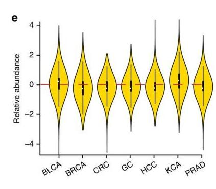
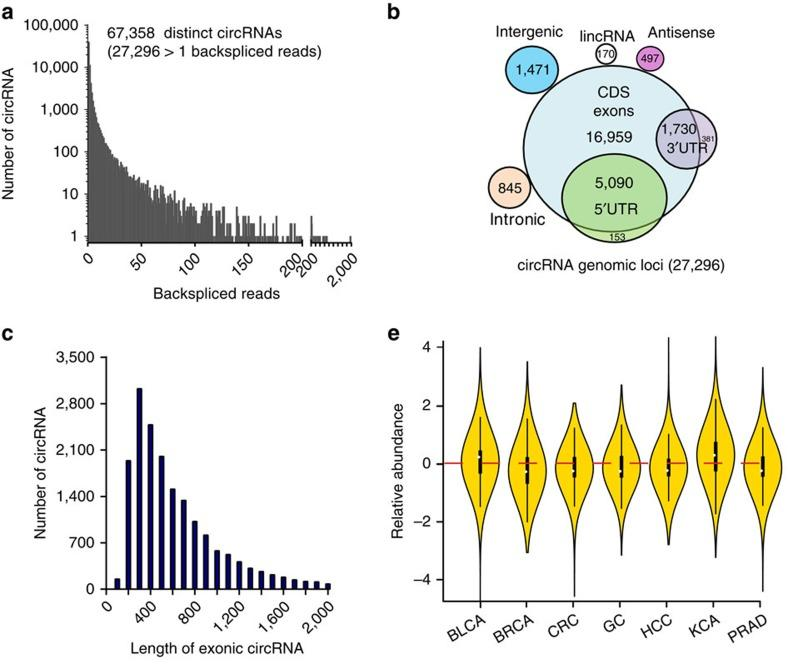
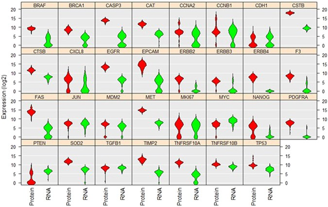
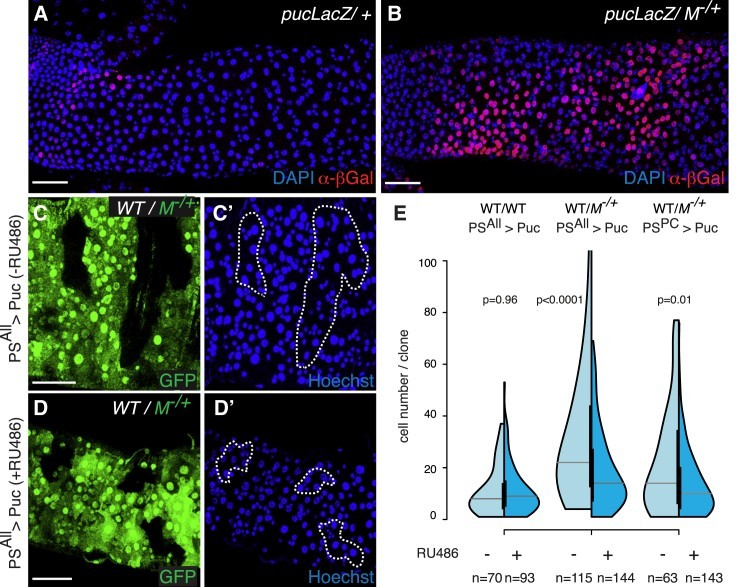
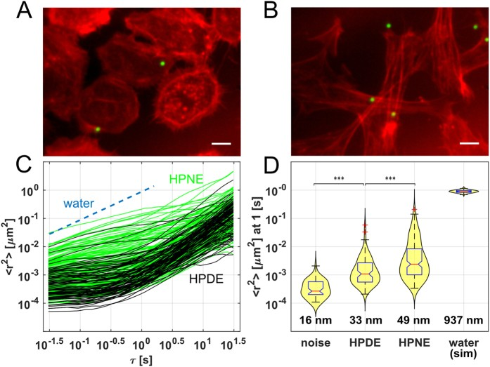

小提琴图（Violin plot）结合了密度图（density plot）和箱线图（box plot）的元素来可视化数据分布。它显示了关键的统计信息，包括中位数、四分位数、最小值和最大值。小提琴图在比较不同组的分布时特别有用，通过揭示数据分布的形状，提供了比传统箱线图更直观的表示。

-   **箱体组件**：白点/线代表中位数，而黑条表示四分位距（IQR）。
-   **核密度组件**：显示不同位置数据点的密度，提供对聚类模式的洞察。

## 示例

{fig-alt="ViolinPlot DEMO" fig-align="center" width="60%"}

## 环境设置

-   系统要求：跨平台（Linux/MacOS/Windows）
-   编程语言：R
-   依赖包：`readr`；`tidyr`；`ggplot2`；`dplyr`；`gghalves`；`forcats`；`hrbrthemes`；`viridis`；`ggstatsplot`；`palmerpenguins`

```{r packages setup, message=FALSE, warning=FALSE, output=FALSE}
# Installing packages
if (!requireNamespace("readr", quietly = TRUE)) {
  install.packages("readr")
}
if (!requireNamespace("tidyr", quietly = TRUE)) {
  install.packages("tidyr")
}
if (!requireNamespace("gghalves", quietly = TRUE)) {
  install.packages("https://cran.r-project.org/src/contrib/Archive/gghalves/gghalves_0.1.4.tar.gz")
}
if (!requireNamespace("dplyr", quietly = TRUE)) {
  install.packages("dplyr")
}
if (!requireNamespace("ggplot2", quietly = TRUE)) {
  install.packages("ggplot2")
}
if (!requireNamespace("ggpubr", quietly = TRUE)) {
  install.packages("ggpubr")
}
if (!requireNamespace("forcats", quietly = TRUE)) {
  install.packages("forcats")
}
if (!requireNamespace("hrbrthemes", quietly = TRUE)) {
  remotes::install_github("hrbrmstr/hrbrthemes")
}
if (!requireNamespace("viridis", quietly = TRUE)) {
  install.packages("viridis")
}
if (!requireNamespace("ggstatsplot", quietly = TRUE)) {
  install.packages("ggstatsplot")
}
if (!requireNamespace("palmerpenguins", quietly = TRUE)) {
  install.packages("palmerpenguins")
}

# Load packages
library(readr)
library(tidyr)
library(ggplot2)
library(ggpubr)
library(dplyr)
library(gghalves)
library(forcats)
library(hrbrthemes)
library(viridis)
library(ggstatsplot)
library(palmerpenguins)
```

```{r}
sessioninfo::session_info("attached")
```

## 数据准备

我们使用了内置的 R 数据集（`iris`、`penguins`）以及来自 [UCSC Xena DATASETS](https://xenabrowser.net/datapages/?hub=https://gdcv18.xenahubs.net:443) 的 `TCGA-BRCA.htseq_counts.tsv` 数据集。为了演示目的，选择了特定的基因。

```{r load data, message=FALSE}
# Load the TCGA-BRCA gene expression dataset from a processed CSV file  
data_counts <- readr::read_csv("https://bizard-1301043367.cos.ap-guangzhou.myqcloud.com/TCGA-BRCA.htseq_counts_processed.csv")

# Load built-in R dataset iris
data_wide <- iris[ , 1:4] # Take the data in columns 1-4 of the iris database as an example

# Load built-in R dataset penguins
data("penguins", package = "palmerpenguins")
data_penguins <- drop_na(penguins) # Remove missing values

# Manually create a demonstration dataset with grouped values 
data <- data.frame(
  name=c( rep("A",500), rep("B",500), rep("B",500), rep("C",20), rep('D', 100)  ),
  value=c( rnorm(500, 10, 5), rnorm(500, 13, 1), rnorm(500, 18, 1), rnorm(20, 25, 4), rnorm(100, 12, 1) )
  )
sample_size <- data %>% 
  group_by(name) %>% 
  summarize(num=n()) # Compute the sample size for each group  
```

## 可视化

### 1. 基础小提琴图

示例 1：使用手动创建数据的基础小提琴图

```{r fig1.1BasicViolin}
#| label: fig-1.1BasicViolin
#| fig-cap: "Basic Violin Plot"
#| out.width: "95%"
#| warning: false

# Basic Violin Plot
p <- ggplot(data, aes(x=name, y=value, fill=name)) + 
  geom_violin()

p
```

示例 2：使用 iris 数据集的基础小提琴图

```{r fig1.2BasicViolin}
#| label: fig-1.2BasicViolin
#| fig-cap: "Basic Violin Plot Using the `iris` Dataset"
#| out.width: "95%"
#| warning: false

# Transform the `iris` dataset from wide format to long format. Use the gather function to collect the data in each column into two new columns named "MesureType" and "Val", so that one row represents one observation.
data_long_iris <- data_wide %>%  
  gather(key = "MeasureType", value = "Value")  

ggplot(data_long_iris, aes(x = MeasureType, y = Value, fill = MeasureType)) +  
  geom_violin()  
```

示例 3：使用 TCGA-BRCA 基因表达数据的小提琴图

```{r fig1.3BasicViolin}
#| label: fig-1.3BasicViolin
#| fig-cap: "Basic Violin Plot Using the `TCGA-BRCA` dataset"
#| out.width: "95%"
#| warning: false

example_counts1 <- data_counts[1:5,] %>%
  gather(key = "sample",value = "gene_expression",3:1219) # Select five example genes for visualization: A1BG, A1BG-AS1, A1CF, A2M, and A2M-AS1.

ggplot(example_counts1, aes(x=gene_name, y=gene_expression, fill=gene_name)) +
  geom_violin()
```

示例 4：带有组间差异显著性标注的基础小提琴图

```{r fig1.4BasicViolinSignificance}
#| label: fig-1.4BasicViolinSignificance
#| fig-cap: "Basic violin plot with significance annotation of differences between groups"
#| out.width: "95%"
#| warning: false

# Organize and group the data
data_long_iris <- data_wide %>%
  gather(key = "MeasureType",
         value = "Value")

# Draw a basic violin plot
p <- ggplot(data_long_iris,
       aes(x = MeasureType,
           y = Value,
           fill = MeasureType)) +
  geom_violin()

# Extract and deduplicate groups
groups <- length(unique(data_long_iris$MeasureType))
if (groups == 2) {
	p <- p +
		stat_compare_means(
			method = "wilcox.test", # c("t.test", "wilcox.test")
			paired = FALSE,
			method.args = list(),
			ref.group = NULL,
			comparisons = NULL,
			hide.ns = FALSE,
			label.sep = ", ",
			label = "p.format", # c("p.signif", "p.format")
			label.x.npc = "left",
			label.y.npc = "top",
			label.x = NULL,
			label.y = NULL,
			vjust = 0,
			tip.length = 0.03,
			bracket.size = 0.3,
			step.increase = 0.1,
			symnum.args = list(),
			geom = "text",
			position = "identity",
			na.rm = FALSE,
			show.legend = NA,
			inherit.aes = TRUE
		)
} else if (groups > 2) {
	p <- p +
		stat_compare_means(
			method = "wilcox.test", # c("t.test", "wilcox.test")
			paired = FALSE,
			method.args = list(),
			ref.group = NULL,
			# Perform pairwise comparisons for multiple group comparisons
			comparisons = combn(unique(as.character(data_long_iris$MeasureType)), 2, simplify = FALSE),
			hide.ns = FALSE,
			label.sep = ", ",
			label = "p.format", # c("p.signif", "p.format")
			label.x.npc = "left",
			label.y.npc = "top",
			label.x = NULL,
			label.y = NULL,
			vjust = 0,
			tip.length = 0.03,
			bracket.size = 0.3,
			step.increase = 0.1,
			symnum.args = list(),
			geom = "text",
			position = "identity",
			na.rm = FALSE,
			show.legend = NA,
			inherit.aes = TRUE
		)
}

p
```

### 2. 水平小提琴图

可以使用 `coord_flip()` 翻转 x 轴和 y 轴。

```{r fig2HorizontalViolin}
#| label: fig-2HorizontalViolin
#| fig-cap: "Horizontal Violin Plot Using the `TCGA-BRCA` dataset"
#| out.width: "95%"
#| warning: false

example_counts2 <- data_counts[1:6,] %>% 
  gather(key = "sample",value = "gene_expression",3:1219) %>% 
  mutate(gene_name= fct_reorder(gene_name,gene_expression ))

ggplot(example_counts2, aes(x=gene_name, y=gene_expression, fill=gene_name, color=gene_name)) +
  geom_violin() +
  scale_fill_viridis(discrete=TRUE) +
  scale_color_viridis(discrete=TRUE) +
  theme_ipsum() + # Improve plot appearance
  theme(legend.position="none" ) +
  coord_flip() + # flip the x and y axes
  xlab("") +
  ylab("Assigned Probability (%)")
```

### 3. 带箱线图的小提琴图

在实际的可视化应用中，可以使用 `geom_boxplot()` 将箱线图添加到小提琴图中，这有助于直观地比较数据的分布。

```{r fig3.1Violinwizbox, message=FALSE}
#| label: fig-3.1Violinwizbox
#| fig-cap: "Violin Plot with Boxplot"
#| out.width: "95%"
#| warning: false

example_data <- data %>% 
  left_join(sample_size) %>%
  mutate(myaxis = paste0(name, "\n", "n=", num)) # The `myaxis` variable is created to display sample size on the x-axis.  

ggplot(example_data, aes(x=myaxis, y=value, fill=name)) +
  geom_violin(width=1.4) +
geom_boxplot( width=0.1,color="grey", alpha=0.2) + # Draw a box plot. A small width value makes the box plot inside the violin plot.
scale_fill_viridis(discrete = TRUE) +
  theme_ipsum() + # Beautify the graph
  theme(
   legend.position="none",
   plot.title = element_text(size=11)
  ) +
  ggtitle("A Violin plot wrapping a boxplot") +  # Set the title
  xlab("")
```

另一个使用 TCGA-BRCA 基因表达数据的带箱线图的小提琴图

```{r fig3.2Violinwizbox, message=FALSE}
#| label: fig-3.2Violinwizbox
#| fig-cap: "Violin Plot with Boxplot Using the `TCGA-BRCA` dataset"
#| out.width: "95%"
#| warning: false

example_counts3 <- data_counts[1:5,] %>%
  gather(key = "sample", value = "gene_expression",3:1219) %>%
  mutate(gene_name= fct_reorder(gene_name,gene_expression ))

ggplot(example_counts3, aes(x=gene_name, y=gene_expression, fill=gene_name, color=gene_name)) +
  geom_violin() +
  geom_boxplot( width=0.1,color="grey", alpha=0.2)+
  scale_fill_viridis(discrete=TRUE) +
  scale_color_viridis(discrete=TRUE) +
  theme_ipsum() + # Beautify the graph
  theme(legend.position="none" ) 
```

### 4. 分组小提琴图

在基础小提琴图的基础上，我们可以通过设置填充（fill）值来实现组内比较。

下面的示例演示了使用 `fill` 美学属性进行组内比较。在这种情况下，使用 `penguins` 数据集。x 变量代表物种，`fill=sex` 创建了组内分类，以可视化比较每个物种内按性别分组的鳍状肢长度。

```{r fig4GroupedViolinPlot, message=FALSE}
#| label: fig-4GroupedViolin
#| fig-cap: "Grouped Violin Plot Using the `penguins` dataset"
#| out.width: "95%"
#| warning: false

ggplot(data_penguins, aes(fill=sex, y=flipper_length_mm, x=species)) + # Use X as the major classification and fill as the intra-group classification
  geom_violin(position="dodge", alpha=0.5, outlier.colour="transparent") +
  scale_fill_viridis(discrete=T, name="") +
  theme_ipsum()  
```

### 5. 半小提琴图

半小提琴图对于以紧凑形式可视化大量数据非常有用。我们可以使用 `geom_half_violin` 函数分别显示两组数据。

在下面的示例中，我们通过将雌性和雄性企鹅绘制在图的相对两侧，来可视化两种企鹅的鳍状肢长度。

```{r fig5Half-ViolinPlot, message=FALSE}
#| label: fig-5Half-ViolinPlot
#| fig-cap: "Half-Violin Plot Using the `penguins` dataset"
#| out.width: "95%"
#| warning: false

# Separate the data for female and male penguins
data_female <- data_penguins %>% filter(sex == "female")
data_male <- data_penguins %>% filter(sex == "male")

# Plot the half-violin plot for both groups (females on the right and males on the left)
ggplot() +
  geom_half_violin(
    data = data_female,
    aes(y = flipper_length_mm, x = species),
    position = position_dodge(width = 1),
    scale = 'width',
    colour = NA,
    fill = "#9370DB",
    alpha = 0.8,  ## Set transparency
    side = "r"
  ) +
  geom_half_violin(
    data = data_male,
    aes(y = flipper_length_mm, x = species),
    position = position_dodge(width = 1),
    scale = 'width',
    colour = NA,
    fill = "#FFFF00",
    alpha = 0.6,
    side = "l"
  )
```

### 6. 使用 `ggstatsplot` 包的小提琴图

`ggstatsplot` 包通过添加强大的统计可视化功能扩展了 `ggplot2`。`ggbetweenstats()` 函数允许创建结合了小提琴图、箱线图和散点图的图表。

在下面的示例中，我们使用 `penguins` 数据集可视化不同企鹅物种的喙长分布。我们进一步使用 `theme()` 函数增强了图表的美观性。

```{r fig6ViolinPlot-ggstatsplot, message=FALSE}
#| label: fig-6ViolinPlot-ggstatsplot
#| fig-cap: "Violin Plot Using the `ggstatsplot` Package"
#| out.width: "95%"
#| warning: false

plt <- ggbetweenstats(
  data = data_penguins,
  x = species,
  y = bill_length_mm
) +
# Beautification
  labs(  ## Add labels and title
    x = "Penguins Species",
    y = "Bill Length",
    title = "Distribution of bill length across penguins species"
  ) +
  theme(
    axis.ticks = element_blank(),
    axis.line = element_line(colour = "grey50"),
    panel.grid = element_line(color = "#b4aea9"),
    panel.grid.minor = element_blank(),
    panel.grid.major.x = element_blank(),
    panel.grid.major.y = element_line(linetype = "dashed"),
    panel.background = element_rect(fill = "#fbf9f4", color = "#fbf9f4"),
    plot.background = element_rect(fill = "#fbf9f4", color = "#fbf9f4")
  )

plt
```

## 应用实例

### 1. 基础小提琴图

::: {#fig-ViolinPlotApplications}
{fig-alt="ViolinPlotApp1" fig-align="center" width="60%"}

基础小提琴图的应用
:::

@fig-ViolinPlotApplications 是七种癌症组织及其相应正常组织中 circRNA 相对丰度的小提琴图 \[1\]。

### 2. 分组小提琴图

::: {#fig-ViolinPlotApplications2}
{fig-alt="ViolinPlotApp2" fig-align="center" width="60%"}

分组小提琴图的应用
:::

上述小提琴图分析并比较了单个 A549 细胞中 31 种蛋白质和 mRNA 的水平及分布 \[2\]。

### 3. 半小提琴图

::: {#fig-ViolinPlotApplications3}
{fig-alt="ViolinPlotApp3" fig-align="center" width="60%"}

半小提琴图的应用
:::

@fig-ViolinPlotApplications3 E 使用半小提琴图分析了 WT 肠道（左图）或 M-/+ 肠道（中图和右图）中 WT 克隆的克隆大小分布 \[3\]。

### 4. 带箱线图的小提琴图

::: {#fig-ViolinPlotApplications4}
{fig-alt="ViolinPlotApp4" fig-align="center" width="60%"}

带箱线图的小提琴图的应用
:::

@fig-ViolinPlotApplications4 D 显示了附着在基底上的液滴（噪声）和水中的液滴（刺激）的预期中位数 MSD（均方位移）和分布，以及纳米级 RMS 位移 \[4\]。

## 参考文献

\[1\] Zheng Q, Bao C, Guo W, Li S, Chen J, Chen B, Luo Y, Lyu D, Li Y, Shi G, Liang L, Gu J, He X, Huang S. Circular RNA profiling reveals an abundant circHIPK3 that regulates cell growth by sponging multiple miRNAs. Nat Commun. 2016 Apr 6;7:11215. doi: 10.1038/ncomms11215. PMID: 27050392; PMCID: PMC4823868.

\[2\] Gong H, Wang X, Liu B, Boutet S, Holcomb I, Dakshinamoorthy G, Ooi A, Sanada C, Sun G, Ramakrishnan R. Single-cell protein-mRNA correlation analysis enabled by multiplexed dual-analyte co-detection. Sci Rep. 2017 Jun 5;7(1):2776. doi: 10.1038/s41598-017-03057-5. PMID: 28584233; PMCID: PMC5459813.

\[3\] Kolahgar G, Suijkerbuijk SJ, Kucinski I, Poirier EZ, Mansour S, Simons BD, Piddini E. Cell Competition Modifies Adult Stem Cell and Tissue Population Dynamics in a JAK-STAT-Dependent Manner. Dev Cell. 2015 Aug 10;34(3):297-309. doi: 10.1016/j.devcel.2015.06.010. Epub 2015 Jul 23. PMID: 26212135; PMCID: PMC4537514.

\[4\] Cribb JA, Osborne LD, Beicker K, Psioda M, Chen J, O'Brien ET, Taylor Ii RM, Vicci L, Hsiao JP, Shao C, Falvo M, Ibrahim JG, Wood KC, Blobe GC, Superfine R. An Automated High-throughput Array Microscope for Cancer Cell Mechanics. Sci Rep. 2016 Jun 6;6:27371. doi: 10.1038/srep27371. PMID: 27265611; PMCID: PMC4893602.

\[5\] Wickham H, Vaughan D, Girlich M (2024). *tidyr: Tidy Messy Data*. R package version 1.3.1, <https://CRAN.R-project.org/package=tidyr>.

\[6\] H. Wickham. ggplot2: Elegant Graphics for Data Analysis. Springer-Verlag New York, 2016.

\[7\] Wickham H, François R, Henry L, Müller K, Vaughan D (2023). *dplyr: A Grammar of Data Manipulation*. R package version 1.1.4, <https://CRAN.R-project.org/package=dplyr>.

\[8\] Tiedemann F (2022). *gghalves: Compose Half-Half Plots Using Your Favourite Geoms*. R package version 0.1.4, <https://CRAN.R-project.org/package=gghalves>.

\[9\] Wickham H (2023). *forcats: Tools for Working with Categorical Variables (Factors)*. R package version 1.0.0, <https://CRAN.R-project.org/package=forcats>.

\[10\] Rudis B (2024). *hrbrthemes: Additional Themes, Theme Components and Utilities for 'ggplot2'*. R package version 0.8.7, <https://CRAN.R-project.org/package=hrbrthemes>.

\[11\] Simon Garnier, Noam Ross, Robert Rudis, Antônio P. Camargo, Marco Sciaini, and Cédric Scherer (2024). viridis(Lite) - Colorblind-Friendly Color Maps for R. viridis package version 0.6.5.

\[12\] Patil, I. (2021). Visualizations with statistical details: The 'ggstatsplot' approach. Journal of Open Source Software, 6(61), 3167, doi:10.21105/joss.03167

\[13\] Horst AM, Hill AP, Gorman KB (2020). palmerpenguins: Palmer Archipelago (Antarctica) penguin data. R package version 0.1.0. https://allisonhorst.github.io/palmerpenguins/. doi: 10.5281/zenodo.3960218.