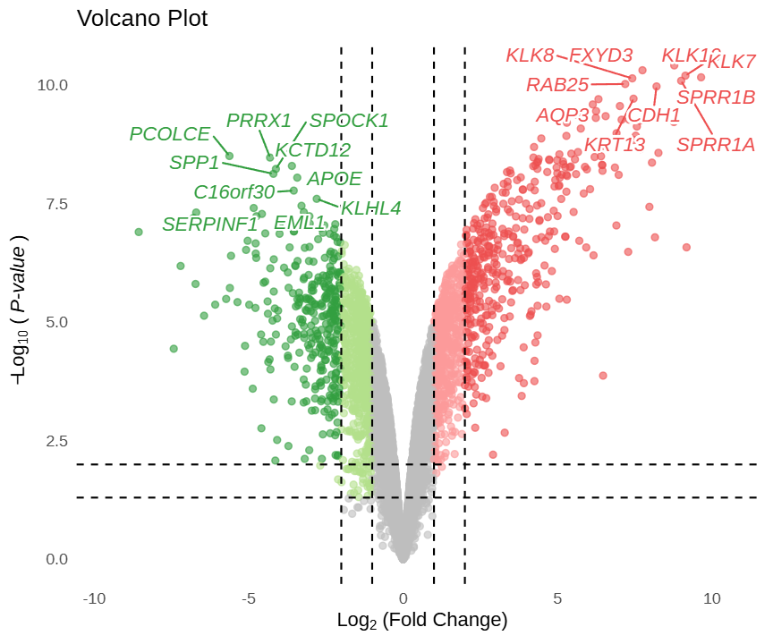
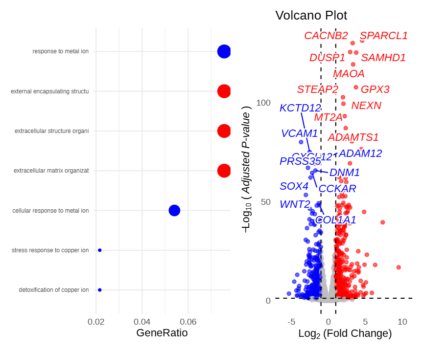

The interactive volcano plot is a visualization tool for differential expression analysis of high-throughput data (e.g., transcriptomics, proteomics). Building upon the traditional volcano plot, it supports mouse hover to view gene information, click to jump to external databases, and provides more flexible threshold settings and color schemes, helping researchers screen and interpret differential analysis results more efficiently.

## Example

{fig-alt="iVolcanoPlot DEMO" fig-align="center" width="60%"}

This is a static preview. 

In this volcano plot, the x-axis represents log2FC values and the y-axis represents -log10(P) values. Gray scatter points indicate non-significant genes; light blue and light red points represent genes meeting conventional thresholds (`pval_cutoff`, `logFC_cutoff`); dark blue and dark red points represent genes simultaneously meeting strict thresholds (`pval_cutoff2`, `logFC_cutoff2`). This color scheme is automatically applied by the FigureYa theme. Hovering over any scatter point displays the gene name, log2(FC), and P.val value; clicking a gene jumps to the GeneCards website. By default, the top 10 up-regulated and top 10 down-regulated genes are labeled.

## Setup

-   System Requirements: Cross-platform (Linux/MacOS/Windows)

-   Programming language: R

-   Dependent packages: `ivolcano`, `fanyi`, `clusterProfiler`, `org.Hs.eg.db`

```{r packages setup, message=FALSE, warning=FALSE, output=FALSE}
# Installing necessary packages
if (!requireNamespace("ggplot2", quietly = TRUE)) {
  install.packages("ggplot2")
}
if (!requireNamespace("ivolcano", quietly = TRUE)) {
  install.packages("ivolcano")
}
if (!requireNamespace("fanyi", quietly = TRUE)) {
  remotes::install_github("YuLab-SMU/fanyi")
}
if (!requireNamespace("clusterProfiler", quietly = TRUE)) {
  install.packages("clusterProfiler")
}
if (!requireNamespace("org.Hs.eg.db", quietly = TRUE)) {
  BiocManager::install("org.Hs.eg.db")
}

# Load packages
library(ggplot2)
library(ivolcano)
library(fanyi)
library(clusterProfiler)
library(org.Hs.eg.db)
```

```{r}
sessioninfo::session_info("attached")
```

## Data Preparation

We use the built-in `easy_input_limma.rds` dataset from the `ivolcano` package, which contains differential analysis results from the human airway epithelial cell airway dataset.

```{r load data, message=FALSE}
# Load data
f1 <- system.file("extdata/easy_input_limma.rds", package = "ivolcano")
df_limma <- readRDS(f1)
# View dataset
head(df_limma)
```

**Note:** The input data frame must contain at least three columns: fold change, significance P value, and gene name. Column names can be specified via corresponding parameters.

## Visualization

### 1. Basic Plotting

You can directly draw an interactive volcano plot using the `ivolcano` function. It outputs an interactive HTML plot by default; set `interactive = FALSE` to obtain a static ggplot object.

```{r}
#| label: fig-1.1BasicPlot
#| fig-cap: "Basic interactive volcano plot"
#| out.width: "95%"
#| warning: false
#| message: false
#| fig-width: 10
#| fig-height: 6

# Basic interactive volcano plot
p <- ivolcano(df_limma,
         logFC_col = "logFC",
         pval_col  = "P.Value",
         gene_col  = "X")

p
```

Figure 1 shows the most basic interactive volcano plot using default parameters. Mouse hover reveals gene information.

::: callout-tip
**Key Parameters:**

- `pval_cutoff`/`logFC_cutoff`: Conventional significance thresholds; genes below these thresholds are classified as non-significant.
- `pval_cutoff2`/`logFC_cutoff2`: Stricter thresholds; genes meeting these conditions are assigned darker colors, split into two levels with the FigureYa green-gray-red color scheme automatically applied. If not set, no stratification occurs.
- `top_n`: Labels the top n most significant up-regulated and down-regulated genes; default is 10.
:::

```{r}
#| label: fig-1.2FigureYa
#| fig-cap: "Dual thresholds with FigureYa theme coloring"
#| out.width: "95%"
#| warning: false
#| message: false
#| fig-width: 10
#| fig-height: 6

# Dual thresholds + FigureYa color scheme
p <- ivolcano(df_limma,
         logFC_col    = "logFC",
         pval_col     = "P.Value",
         gene_col     = "X",
         pval_cutoff  = 0.05,
         pval_cutoff2 = 0.01,
         logFC_cutoff  = 1,
         logFC_cutoff2 = 2,
         top_n = 5)

p
```

::: callout-tip
**Key Parameters:**

- `size_by`: Maps scatter point size to a statistic or data column to enhance visual hierarchy. Options include `"none"` (default), `"negLogP"`, `"absLogFC"`, or any column name in the data frame.
- `point_size`: Only effective when `size_by = "manual"`, sets point sizes for non-significant (base), moderately significant (medium), and highly significant (large) points.
:::

```{r}
#| label: fig-1.3size_by
#| fig-cap: "Map point size by -log10(P) value"
#| out.width: "95%"
#| warning: false
#| message: false
#| fig-width: 10
#| fig-height: 6

# Map point size by negLogP
p <- ivolcano(df_limma,
         logFC_col  = "logFC",
         pval_col   = "P.Value",
         gene_col   = "X",
         size_by    = "negLogP")

p
```

```{r}
#| label: fig-1.4sizeManual
#| fig-cap: "Manually specify point sizes by layer (base=2, medium=4, large=6)"
#| out.width: "95%"
#| warning: false
#| message: false
#| fig-width: 10
#| fig-height: 6

# Manually specify point sizes by significance level
p <- ivolcano(df_limma,
         logFC_col    = "logFC",
         pval_col     = "P.Value",
         gene_col     = "X",
         pval_cutoff  = 0.05,
         pval_cutoff2 = 0.01,
         logFC_cutoff  = 1,
         logFC_cutoff2 = 2,
         size_by = "manual",
         point_size = list(base = 2, medium = 4, large = 6))

p
```

::: callout-tip
**Key Parameters:**

- `filter`: Allows direct filtering of genes to label as a string, e.g., `X %in% genes` to label a specified gene set. Once `filter` is specified, the `top_n` parameter is automatically disabled.
:::

```{r}
#| label: fig-1.5filter
#| fig-cap: "Label extremely differential genes (logFC > 8)"
#| out.width: "95%"
#| warning: false
#| message: false
#| fig-width: 10
#| fig-height: 6

# Label genes with logFC > 8
p <- ivolcano(df_limma,
         logFC_col   = "logFC",
         pval_col    = "P.Value",
         gene_col    = "X",
         pval_cutoff  = 0.05,
         logFC_cutoff  = 1,
         filter = "logFC > 8")

p
```

### 2. Click-to-Jump and Rich Information Cards

The `onclick_fun` parameter in the `ivolcano` function accepts a function defining the behavior after clicking a scatter point. Built-in functions allow direct jumps to common gene databases.

```{r}
#| label: fig-2.1Onclick_fun
#| fig-cap: "Click gene to jump to NCBI"
#| out.width: "95%"
#| warning: false
#| message: false
#| fig-width: 10
#| fig-height: 6

# Click gene to jump to NCBI
p <- ivolcano(df_limma,
         logFC_col   = "logFC",
         pval_col    = "P.Value",
         gene_col    = "X",
         onclick_fun = onclick_ncbi)

p
```

In Figure 6, clicking any gene opens its NCBI page.

::: callout-tip
**Key Parameters:**

- `onclick_fun`: Built-in jump functions include `onclick_genecards`, `onclick_ncbi`, `onclick_ensembl`, `onclick_pubmed`, etc.
- `onclick_fanyi`: Provided by the fanyi package, allows creating custom click-to-display functions based on a gene information data frame.
:::

```{r}
#| label: fig-2.2Fanyi
#| fig-cap: "Click top 50 significant genes to display annotation information cards"
#| out.width: "95%"
#| warning: false
#| message: false
#| fig-width: 10
#| fig-height: 6

# Prepare gene summary data
df_limma$entrez <- mapIds(org.Hs.eg.db, keys = df_limma$X,
                    column = "ENTREZID", keytype = "SYMBOL",
                    multiVals = "first")
top_eg <- df_limma$entrez[order(df_limma$P.Value)][1:50]
gs <- gene_summary(top_eg)

# Define click function: display description (full gene name) and summary
onclick_fun <- onclick_fanyi(gs, c("description", "summary"))

p <- ivolcano(df_limma,
              logFC_col   = "logFC",
              pval_col    = "P.Value",
              gene_col    = "X",
              onclick_fun = onclick_fun)

p
```

### 3. Pathway and Volcano Plot Linkage

The `pathway_volcano` function can display an enrichment analysis dot plot alongside a volcano plot in parallel. Clicking a pathway highlights the genes within that pathway in the volcano plot on the right.

```{r}
#| label: fig-3.1PathwayVolcano
#| fig-cap: "Pathway dot plot linked with volcano plot"
#| out.width: "95%"
#| warning: false
#| message: false
#| fig-width: 10
#| fig-height: 6

# Prepare airway differential analysis data and perform GO enrichment analysis
f2 <- system.file("extdata/airway.rds", package = "ivolcano")
df_airway <- readRDS(f2)
sig_genes <- df_airway$symbol[df_airway$padj < 0.01 & abs(df_airway$log2FoldChange) > 2]
sig_genes <- sig_genes[!is.na(sig_genes)]
entrez <- na.omit(mapIds(org.Hs.eg.db, sig_genes, "ENTREZID", "SYMBOL", multiVals = "first"))

ego <- enrichGO(gene = as.character(entrez), OrgDb = org.Hs.eg.db, ont = "BP",
                pAdjustMethod = "BH", pvalueCutoff = 0.01, qvalueCutoff = 0.05)
ego <- setReadable(ego, OrgDb = org.Hs.eg.db, keyType = "ENTREZID")

# Build interactive dot plot and volcano plot, and combine them
p_dot <- idotplot(ego, showCategory = 8) +
  theme(axis.text.y = element_text(size = 6),
        legend.position = "none") +
  scale_y_discrete(labels = function(x) strtrim(x, 30))
p_vol <- ivolcano(df_airway, logFC_col = "log2FoldChange", pval_col = "padj",
                  gene_col = "symbol", title = "Volcano Plot", interactive = TRUE)
pathway_volcano(p_dot, p_vol, widths = c(1, 1))
```

Figure 8 demonstrates the linkage effect between the pathway dot plot and the volcano plot. Clicking a pathway on the left highlights the genes within that pathway in the volcano plot on the right, while other genes turn gray.

::: callout-tip
**Note:**

- `idotplot`: Generates the dot plot (bubble plot) on the left, displaying the top 8 significantly enriched GO pathways.
- `ivolcano`: Generates the volcano plot on the right; gene names (`gene_col = "symbol"`) must be consistent with the gene SYMBOLs in the enrichment results to ensure proper linkage highlighting.
- `pathway_volcano`: Combines the two plots; the `widths` parameter adjusts the relative widths of the left and right plots.
:::

## Application Scenarios

::: {#fig-iVolcanoApplications}
{fig-alt="Pathway and volcano plot linkage application" fig-align="center" width="60%"}

Pathway and volcano plot linkage application
:::

Figure 9 demonstrates the application of the `pathway_volcano` linkage function in multi-omics integrative analysis. After screening a large number of differentially expressed genes, enrichment analysis can be used to identify key pathways, and then the volcano plot can intuitively display the specific expression change direction and significance of genes within these pathways, facilitating rapid candidate biomarker screening.

## References

1.  Guangchuang Yu, et al. (2024). ivolcano: Interactive Volcano Plots. R package version 0.99.0.
2. [ivolcano FigureYa wechat post](https://mp.weixin.qq.com/s/x24vW4cCLLDWulgkZ2F8Sw)