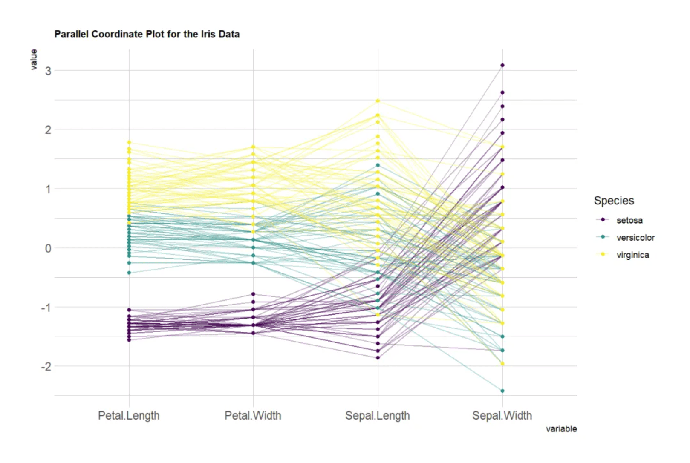
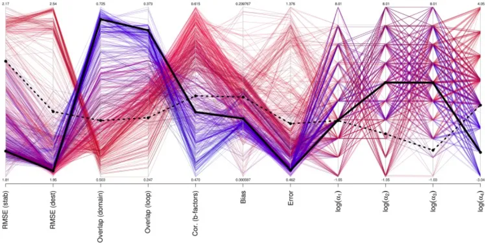
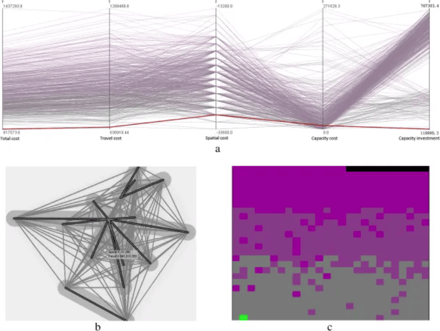
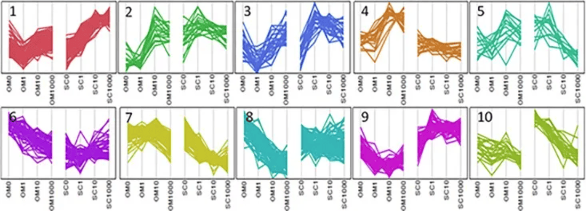

Parallel coordinate plots (Parallel coordinate plots) are a common method for visualizing high-dimensional multivariate data. To display a set of objects in multidimensional space, multiple parallel and equidistant coordinate axes are drawn, and objects in multidimensional space are represented as polylines with vertices on the parallel axes. Although parallel line plots are a special type of line plot, they are significantly different from ordinary line plots. This is because parallel line plots are not limited to describing changes in one or several trends. Parallel coordinate plots can be used to describe specific values at different time points in a time series, different gradients of reaction concentration, and other locations.

## Example

{fig-alt="Parallel Plot DEMO" fig-align="center" width="60%"}

The position of the vertex on each axis corresponds to the variable value of that object in that dimension. This parallel coordinate plot based on the Iris dataset uses four variables (sepal length, sepal width, petal length, and petal width) as the vertical axes. Each line represents a data point (a flower sample), and the color of the line indicates the flower category (Setosa, Versicolor, Virginica). The line passes through the points on each axis, showing the value of the sample for each variable. By observing the trends and intersections of these lines, you can see the differences or similarities between different flower categories in these variables. If the lines do not cross, it means the groups perform similarly on these variables; if they cross frequently, it means there are significant differences between the groups on these variables.

## Settings

-   System requirements: Cross-platform (Linux/MacOS/Windows)
-   Programming language: R
-   Dependency packages: `GGally`; `hrbrthemes`; `viridis`; `dplyr`; `tidyr`; `tibble`; `ggbump`; `RColorBrewer`; `patchwork`; `MASS`

```{r packages setup, message=FALSE, warning=FALSE, output=FALSE}
# Install packages
if (!requireNamespace("GGally", quietly = TRUE)) {
  install.packages("GGally")
}
if (!requireNamespace("hrbrthemes", quietly = TRUE)) {
  install.packages("hrbrthemes")
}
if (!requireNamespace("viridis", quietly = TRUE)) {
  install.packages("viridis")
}
if (!requireNamespace("dplyr", quietly = TRUE)) {
  install.packages("dplyr")
}
if (!requireNamespace("tidyr", quietly = TRUE)) {
  install.packages("tidyr")
}
if (!requireNamespace("tibble", quietly = TRUE)) {
  install.packages("tibble")
}
if (!requireNamespace("ggbump", quietly = TRUE)) {
  install.packages("https://cran.r-project.org/src/contrib/Archive/ggbump/ggbump_0.1.0.tar.gz")
}
if (!requireNamespace("RColorBrewer", quietly = TRUE)) {
  install.packages("RColorBrewer")
}
if (!requireNamespace("patchwork", quietly = TRUE)) {
  install.packages("patchwork")
}
if (!requireNamespace("MASS", quietly = TRUE)) {
  install.packages("MASS")
}

# Load packages
library(GGally)
library(hrbrthemes)
library(viridis)
library(dplyr)
library(tidyr)
library(tibble)
library(ggbump)
library(RColorBrewer)
library(patchwork)
library(MASS)
```

```{r}
sessioninfo::session_info("attached")
```

## Data Preparation

We used the R dataset `iris` and `TCGA-CHOL.methylation450.tsv` from the UCSC Xena website (UCSC Xena (xenabrowser.net)).

```{r load data}
#| message: false
#| warning: false

# iris
data_iris <- iris
data_iris <- data_iris %>%
  group_by(Species) %>%
  sample_n(size = 20, replace = FALSE)

# TCGA-CHOL.methylation450
methylation_raw <- readr::read_tsv("https://bizard-1301043367.cos.ap-guangzhou.myqcloud.com/TCGA-CHOL.methylation450_.tsv")
methylation_selected <- methylation_raw[c(5,7,11),c(4:6)]
rownames(methylation_selected) <- c("cg236", "cg292", "cg658")
colnames(methylation_selected) <- substr(colnames(methylation_selected), 9, 12)
data_tcga <- methylation_selected %>%
  rownames_to_column(var = "Composite") %>%
  pivot_longer(cols = -Composite, names_to = "sample", values_to = "value")
data_tcga <- data_tcga %>%
  mutate(sample = as.numeric(factor(sample))) # Convert the sample to a numerical value
```

## Visualization

### 1. Basic Plotting

Use the `ggparcoord()` function from the `ggally` package to draw the parallel plot; this package is an extension of the `ggplot2` package.

#### 1.1 Basic Parallel Plot

The input dataset must be a data frame containing multiple numerical variables, each of which will be used as a vertical axis on the plot. The number of columns for these variables is specified in the `columns` parameter of the function. Here, the categorical variable used to color the lines is specified in the `groupColumn` parameter.

```{r fig1BasicPlot}
#| label: fig-BasicPlot
#| fig-cap: "Basic parallel graph"
#| out.width: "95%"
#| warning: false

# Basic parallel graph
p <- ggparcoord(data_iris, columns = 1:4, groupColumn = 5) 

p
```

This parallel coordinate plot shows the relationship between sepal length, sepal width, petal length, and petal width in the `iris` dataset. Each line represents a sample, and the flower category specified by `groupColumn` is used to distinguish the color of the lines.

#### 1.2 Customizing Colors, Themes, and Overall Appearance

This chart is similar to the previous basic one but includes the following customizations:

-   Uses the `viridis` package to change the palette colors
-   Uses `title` to add a title and customize the `theme`
-   Uses `showPoints` to add points
-   Uses `alphaLines` to change line transparency
-   Uses `theme_ipsum()` to apply a theme

```{r fig2CustomColor}
#| label: fig-CustomColor
#| fig-cap: "Customize colors, themes, and overall appearance"
#| out.width: "95%"
#| warning: false

# Customize colors, themes, and overall appearance
p <- ggparcoord(data_iris,
           columns = 1:4, groupColumn = 5, order = "anyClass",
           showPoints = TRUE, 
           title = "Parallel Coordinate Plot for the Iris Data",
           alphaLines = 0.3) + 
  scale_color_viridis(discrete=TRUE) +
  theme_ipsum()+
  theme(plot.title = element_text(size=10))

p
```

This parallel coordinate plot shows the relationship between sepal length, sepal width, petal length, and petal width in the `iris` dataset. A custom appearance is used to make the image more aesthetically pleasing and easier to read.

#### 1.3 Standardization

Standardization transforms the original data for comparison with other variables. This is a key step in comparing variables that do not have the same units.

The `ggally` package provides a scaling parameter `scale`. Here are the four possible options applied to the same dataset:

-   `globalminmax` → No normalization
-   `uniminmax` → Normalized to minimum = 0 and maximum = 1
-   `std` → Univariate normalization (subtract mean and divide by standard deviation)
-   `center` → Normalized and centered variables (variables centered at zero)

```{r fig3scale}
#| label: fig-scale
#| fig-cap: "Standardization"
#| out.width: "95%"
#| warning: false
#| fig-width: 12
#| fig-height: 8

# No standardization
p1 <- ggparcoord(data_iris,
    columns = 1:4, groupColumn = 5, order = "anyClass",
    scale="globalminmax",
    showPoints = TRUE, 
    title = "No scaling",
    alphaLines = 0.3
    ) + 
  scale_color_viridis(discrete=TRUE) +
  theme_ipsum()+
  theme(
    legend.position="none",
    plot.title = element_text(size=13)
  ) +
  xlab("")

# Standardize to Min = 0 and Max = 1
p2 <- ggparcoord(data_iris,
    columns = 1:4, groupColumn = 5, order = "anyClass",
    scale="uniminmax",
    showPoints = TRUE, 
    title = "Standardize to Min = 0 and Max = 1",
    alphaLines = 0.3
    ) + 
  scale_color_viridis(discrete=TRUE) +
  theme_ipsum()+
  theme(
    legend.position="none",
    plot.title = element_text(size=13)
  ) +
  xlab("")

# Normalize univariately
p3 <- ggparcoord(data_iris,
    columns = 1:4, groupColumn = 5, order = "anyClass",
    scale="std",
    showPoints = TRUE, 
    title = "Normalize univariately (substract mean & divide by sd)",
    alphaLines = 0.3
    ) + 
  scale_color_viridis(discrete=TRUE) +
  theme_ipsum()+
  theme(
    legend.position="none",
    plot.title = element_text(size=13)
  ) +
  xlab("")

# Standardize and center variables
p4 <- ggparcoord(data_iris,
    columns = 1:4, groupColumn = 5, order = "anyClass",
    scale="center",
    showPoints = TRUE, 
    title = "Standardize and center variables",
    alphaLines = 0.3
    ) + 
  scale_color_viridis(discrete=TRUE) +
  theme_ipsum()+
  theme(
    legend.position="none",
    plot.title = element_text(size=13)
  ) +
  xlab("")

p1 + p2 + p3 + p4 + plot_layout(ncol = 2)
```

These four plots show the impact of different normalization methods on the `iris` dataset:

1.  **No scaling**: Shows the original data, with each variable retaining its original range. Variables with larger numerical ranges are more prominent.
2.  **Normalized to minimum = 0 and maximum = 1**: Values of all variables are scaled to the same range (0 to 1) to facilitate comparison of trends across different variables.
3.  **Univariate normalization**: Each variable is normalized to a mean of 0 and a standard deviation of 1 to highlight the relative differences in the data.
4.  **Normalized and centered variables**: Data is mean-centered to highlight the relative differences of different groups on each variable.

These charts use color to distinguish different flower species and use lines to represent the values of each sample across different variables.

#### 1.4 Highlighting Groups

If you are interested in specific groups, you can highlight different categories by changing their colors:

```{r fig4highlight}
#| label: fig-highlight
#| fig-cap: "Highlight Group"
#| out.width: "95%"
#| warning: false

# Highlight Group
p <- data_iris %>%
  arrange(desc(Species)) %>%
  ggparcoord(
    columns = 1:4, groupColumn = 5, order = "anyClass",
    showPoints = TRUE, 
    title = "Original",
    alphaLines = 1
    ) + 
  scale_color_manual(values=c( "#69b3a2", "#E8E8E8", "#E8E8E8") ) + # Highlight specific groups by changing the colors of different categories
  theme_ipsum()+
  theme(
    legend.position="Default",
    plot.title = element_text(size=10)
  ) +
  xlab("")

p
```

This plot shows the performance of different flower species in the `iris` dataset across four characteristics (sepal length, sepal width, petal length, and petal width). A parallel coordinate plot is used to display the value of each sample for these variables. By sorting and coloring samples by species in descending order, the `Setosa` species is highlighted in green, while the other two species are displayed in gray. The lines represent samples, showing the variation of their values across different characteristics.

### 2. MASS Package

#### 2.1 Basic Parallel Plot (MASS Package)

Use the `MASS` package to build a parallel coordinate plot. Note that using `ggplot2` might be a better choice.

```{r fig5MASS}
#| label: fig-MASS
#| fig-cap: "MASS package"
#| out.width: "95%"
#| warning: false

my_colors <- colors()[as.numeric(data_iris$Species) * 11]
parcoord(data_iris[, c(1:4)], col = my_colors)
```

This is a parallel coordinate plot of the `Iris` dataset, showing the distribution of four variables (sepal length, sepal width, petal length, and petal width) in the dataset. Different flower species are distinguished by different colors. By observing the trends of lines of different colors, we can see different patterns of these variables across different flower species.

#### 2.2 Adding a Legend

Use `legend()` to add a legend.

```{r fig6MASSlegend}
#| label: fig-MASSlegend
#| fig-cap: "Add legend"
#| out.width: "95%"
#| warning: false

my_colors <- colors()[as.numeric(data_iris$Species) * 11]
parcoord(data_iris[, c(1:4)], col = my_colors)

legend("topright", 
       legend = levels(data_iris$Species), 
       col = unique(my_colors), 
       pch = 1) # Add legend
```

This is a parallel coordinate plot of the `Iris` dataset, showing the distribution of four variables (sepal length, sepal width, petal length, and petal width) in the dataset. Different flower species are distinguished by different colors, and a legend is provided. By observing the trends of lines of different colors, you can see the different patterns of these variables for each flower species.

#### 2.3 Reordering Variables

Finding the optimal order of variables in a parallel coordinate plot is very important. To change it, simply change the order in the input dataset.

```{r fig7MASSreorder}
#| label: fig-MASSreorder
#| fig-cap: "Reorder variables"
#| out.width: "95%"
#| warning: false

palette <- brewer.pal(3, "Set1") 
my_colors <- palette[as.numeric(data_iris$Species)]

parcoord(data_iris[,c(1,3,4,2)] , col= my_colors)
```

This is a parallel coordinate plot of the Iris dataset, showing the distribution of four variables: sepal length, petal length, petal width, and sepal width. Different flower species are represented by three different colors. By observing the changes in the colored lines, we can see the different trends of these variables across different flower species. Reordering the variables in the input dataset will reorder the variables in the plot.

#### 2.4 Highlighting Groups

If you are interested in specific groups, you can change the colors to highlight that group.

```{r fig8MASShighlight}
#| label: fig-MASShighlight
#| fig-cap: "Highlight Group"
#| out.width: "95%"
#| warning: false

isSetosa <- ifelse(data_iris$Species=="setosa","red","grey")
parcoord(data_iris[,c(1,3,4,2)] , col=isSetosa)
```

This is a parallel coordinate plot of the Iris dataset, where setosa is shown in red and other species are shown in gray. The plot visually illustrates the differences between setosa and other species in sepal length, petal length, petal width, and sepal width.

### 3. Bump Plot

A bump plot is a chart that can intuitively display trends and is often used to compare data across different categories.

#### 3.1 Basic Bump Plot

```{r fig9BasicBump}
#| label: fig-BasicBump
#| fig-cap: "Basic bump plot"
#| out.width: "95%"
#| warning: false

p <- ggplot(data_tcga, aes(x = sample, y = value, color = Composite)) +  
  geom_bump(size = 2) +  
  theme_minimal()
p
```

This plot shows the methylation trends of different compounds (cg236, cg292, and cg658) across different samples. Colors distinguish different compound groups, and lines represent the performance of each group across different samples. The fluctuations in the lines reveal the trends and relative differences in the values of each group across different samples.

#### 3.2 Changing Colors

Individual points can be added to the bump plot. This can be achieved by adding a `geom_point()` layer. Bump plots are drawn using the `ggbump` package.

```{r fig10BumpChangeColor}
#| label: fig-BumpChangeColor
#| fig-cap: "Change color"
#| out.width: "95%"
#| warning: false

p <- ggplot(data_tcga, aes(x = sample, y = value, color = Composite)) +  
  geom_bump(size = 2) +  
  geom_point(size = 6) +  
  scale_color_brewer(palette = "Paired") +  
  theme_minimal()
p
```

This plot shows the methylation trends of different compounds (cg236, cg292, and cg658) across different samples. Colors are used to distinguish different compound groups, and lines represent the performance of each group across different samples. The fluctuations in the lines reveal the trends and relative differences in the values of each group across different samples. Adding points and changing colors makes the chart more visually appealing and easier to read.

#### 3.3 Adding Labels and Titles

The `geom_text()` and `labs()` functions can be used to add labels and titles to the chart.

```{r fig11BumpLabel}
#| label: fig-BumpLabel
#| fig-cap: "Add labels and titles"
#| out.width: "95%"
#| warning: false

p <- ggplot(data_tcga, aes(x = sample, y = value, color = Composite)) +  
  geom_bump(size = 2) +  
  geom_point(size = 6) +  
  geom_text(aes(label = Composite), nudge_y = -0.01, fontface = "bold", size=3) + 
  scale_color_brewer(palette = "Paired") +  
  theme_minimal() +  
  labs(title = "Bump Plot of Methylation Values",    
     x = "Sample", y = "Value")
p
```

This plot shows the methylation changes of different compounds (cg236, cg292, and cg658) across different samples. Lines represent the numerical trends of each compound across different samples, points represent specific values, and labels indicate the names of the compounds. Colors distinguish different compounds, and the lines show their numerical fluctuations across different samples.

## Applications

### 1. Basic Parallel Plot

::: {#fig-ParallelApplications}
{fig-alt="ParallelApp1" fig-align="center" width="60%"}

Basic parallel plot application 1
:::

Performance of different parameter sets for mutation, b-factor, and motion prediction. [1]

::: {#fig-ParallelApplications}
{fig-alt="ParallelApp2" fig-align="center" width="60%"}

Basic parallel plot application 2
:::

Selection of optimal healthcare centers in a mixed traffic network using (a) parallel coordinate plots, (b) bivariate geoplots, and (c) space-filling grids. (Note: Two variables, total cost and travel cost, are visualized in the space-filling grid. Total cost is represented by a color gradient from gray to purple, and travel cost is sorted using scan lines from left to right and bottom to top.) [2]

### 2. Faceted Parallel Plot

::: {#fig-ParallelApplications}
{fig-alt="ParallelApp3" fig-align="center" width="60%"}

Faceted parallel plot application
:::

Parallel plots illustrating the cluster analysis of genes showing Depot*[Dex] interactions. [3]

## References

\[1\] Frappier V, Najmanovich RJ. A coarse-grained elastic network atom contact model and its use in the simulation of protein dynamics and the prediction of the effect of mutations. PLoS Comput Biol. 2014 Apr 24;10(4):e1003569. doi: 10.1371/journal.pcbi.1003569. PMID: 24762569; PMCID: PMC3998880.

\[2\] Jia T, Tao H, Qin K, Wang Y, Liu C, Gao Q. Selecting the optimal healthcare centers with a modified P-median model: a visual analytic perspective. Int J Health Geogr. 2014 Oct 22;13:42. doi: 10.1186/1476-072X-13-42. PMID: 25336302; PMCID: PMC4293817.

\[3\] Pickering RT, Lee MJ, Karastergiou K, Gower A, Fried SK. Depot Dependent Effects of Dexamethasone on Gene Expression in Human Omental and Abdominal Subcutaneous Adipose Tissues from Obese Women. PLoS One. 2016 Dec 22;11(12):e0167337. doi: 10.1371/journal.pone.0167337. PMID: 28005982; PMCID: PMC5179014.

\[4\] Schloerke, B., Crowley, J., Cook, D., Hofmann, H., Wickham, H. (2021). GGally: Extension to 'ggplot2'. https://cran.r-project.org/package=GGally

\[5\] Rudis, B. (2020). hrbrthemes: Additional Themes and Theme Components for 'ggplot2'. https://cran.r-project.org/package=hrbrthemes

\[6\] Garnier, S. (2018). viridis: Colorblind-Friendly Color Maps for R. https://cran.r-project.org/package=viridis

\[7\] Wickham, H., François, R., Henry, L., Müller, K. (2023). dplyr: A Grammar of Data Manipulation. https://cran.r-project.org/package=dplyr

\[8\] Wickham, H., Henry, L. (2023). tidyr: Tidy Messy Data. https://cran.r-project.org/package=tidyr

\[9\] Müller, K. (2023). tibble: Simple Data Frames. https://cran.r-project.org/package=tibble

\[10\] Aumayr, A., & Münch, B. (2022). ggbump: Bump Charts with ggplot2. https://cran.r-project.org/package=ggbump

\[11\] Neuwirth, E. (2023). RColorBrewer: ColorBrewer Palettes. https://cran.r-project.org/package=RColorBrewer